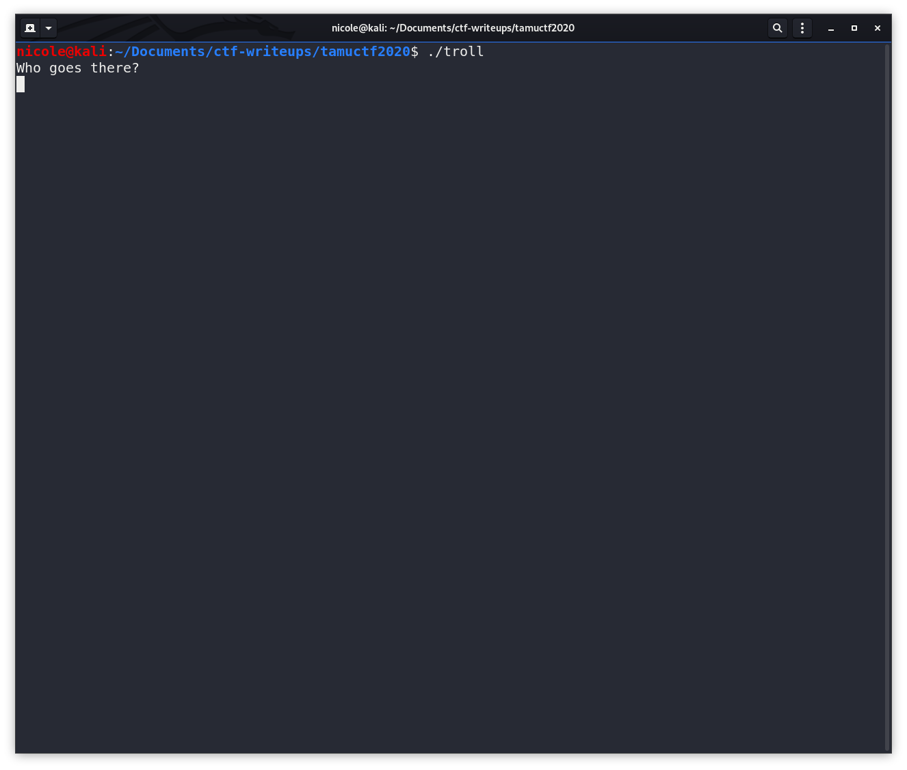
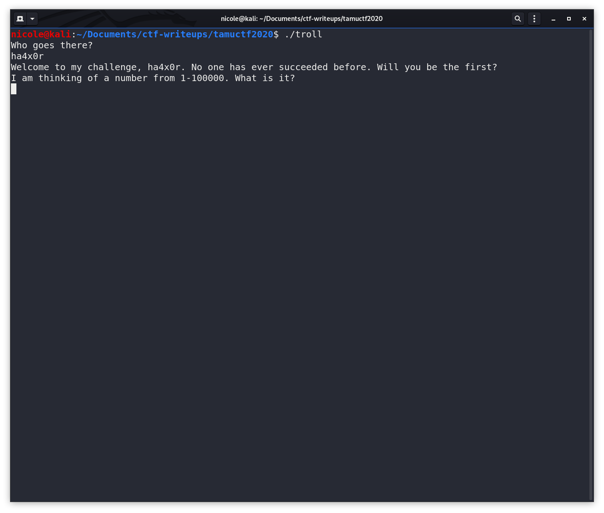
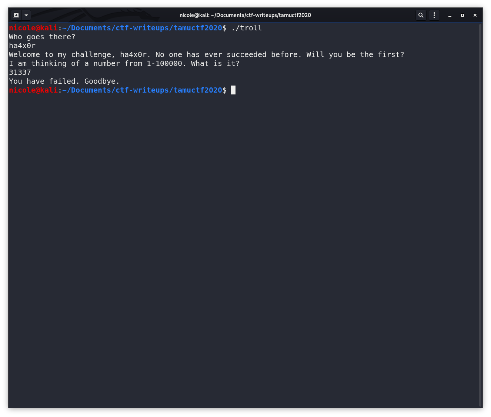

# Troll Writeup



When we run it, we see that it prompts us to id ourselves. Cool... Giving your creds to a troll... Seems legit.



Next, we're prompted to enter a number between 1-100000. Specific. We'll come back to that when we get to ghidra. For now, let's give the troll what he wants.



Welp that was whole unexpected. Let's open ```troll``` in ghidra and see what's going on.

```troll``` required a knowledge of pseudo-random numbers and what makes them pseudo-random.
